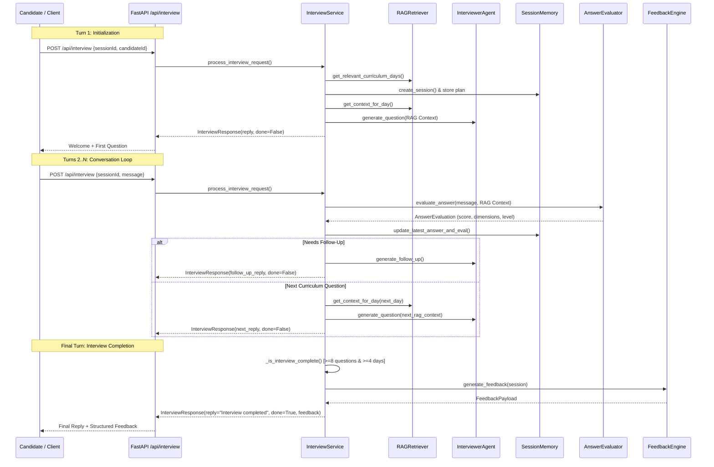

# 🎯 Production-Quality AI Technical Interview Agent

An enterprise-ready, RAG-powered, adaptive multi-turn AI Technical Interview Agent built with **FastAPI**, **Google Gemini LLM**, **Vector TF-IDF/Cosine Similarity RAG Engine**, and **Stateful In-Memory Session Storage**.

The agent acts as a Senior Technical Interviewer, conducting multi-turn interactive technical interviews that adapt dynamically to candidate answers, track detailed history across curriculum days, evaluate multi-dimensional performance criteria, and generate structured feedback.

---

## 🌟 Key Features

- **🎯 Technical Specification Compliance**: Fully implements `POST /api/interview` exact request/response schema without breaking compatibility.
- **📚 Advanced RAG Engine**: Semantic curriculum chunking, TF-IDF vector embeddings, cosine similarity top-$k$ search, and context injection.
- **🧠 Multi-Turn Session Memory**: Thread-safe state tracking for question history, candidate answers, turn scores, covered concepts, weak concepts, and adaptive difficulty.
- **📊 Multi-Dimensional Answer Evaluator**: Evaluates answers across **Correctness**, **Depth**, **Clarity**, **Examples**, **Terminology**, and **Confidence**.
- **⚡ Adaptive Questioning**:
  - High Performance ($\ge 4.0$) $\rightarrow$ Escalates to high-difficulty system architecture & trade-off questions.
  - Low/Weak Performance ($< 2.5$) $\rightarrow$ Adapts to fundamental concept probing and clarifying follow-up questions.
- **🛡️ Production Resilience & Fallbacks**: Features automatic retry handling, rate-limit (429) detection, and seamless zero-downtime fallback to a local prompt generation engine.
- **💻 Built-in Frontend Interface**: Serves a sleek interactive web UI at root (`http://localhost:8000/`).

---

## 🏗️ Architecture & Module Structure

```
Interview-agent/
├── app/
│   ├── __init__.py
│   ├── api.py                 # API router for POST /api/interview
│   ├── config.py              # Application settings, env vars, model & RAG configuration
│   └── main.py                # FastAPI app initialization, CORS, static mounts, routes
├── agents/
│   ├── __init__.py
│   ├── evaluator.py           # Multi-dimensional AnswerEvaluator
│   ├── feedback.py            # Structured FeedbackEngine for final assessment payload
│   ├── interviewer.py         # AI Interviewer Agent (Gemini LLM + fallback engine)
│   └── planner.py             # InterviewPlanner (curriculum plan, day selection)
├── rag/
│   ├── __init__.py
│   ├── embeddings.py          # Vector embedding service (TF-IDF + Cosine similarity)
│   ├── loader.py              # Dataset loader & semantic chunker for curriculum.json
│   └── retriever.py           # RAGRetriever (vector indexing, top-k search, candidate filtering)
├── memory/
│   ├── __init__.py
│   └── session_memory.py      # Thread-safe SessionMemory & TurnRecord tracking
├── services/
│   ├── __init__.py
│   └── interview_service.py   # Main orchestration service connecting all components
├── utils/
│   ├── __init__.py
│   ├── constants.py           # System-wide configuration constants & scoring weights
│   └── logger.py              # Structured application logging
├── tests/
│   ├── __init__.py
│   ├── test_api.py            # API endpoint integration tests
│   ├── test_evaluation.py     # Evaluator & Feedback engine tests
│   ├── test_interview_flow.py # End-to-end multi-turn interview flow tests
│   └── test_retrieval.py      # RAG retriever & embedding engine tests
├── data/
│   ├── candidates.json        # Candidate profile dataset
│   └── curriculum.json        # 31-day AI Cohort curriculum dataset
├── frontend/                  # Web UI interface
│   ├── index.html
│   ├── script.js
│   └── style.css
├── app.py                     # Main application entry point re-exporting app
├── run_tests.py               # Master test runner script
├── requirements.txt           # Python dependencies
├── .env                       # Environment variables configuration
├── technical-spec .md         # Original HTTP API contract specification
└── README.md                  # Project documentation
```

---

## 🔄 How the Interview Flow Works



---

## 🔍 How RAG Works

1. **Semantic Text Chunking (`rag/loader.py`)**:
   Curriculum data from `curriculum.json` is broken down into structured semantic chunks:
   - **Overview Chunks**: High-level module and day summary.
   - **Objective Chunks**: Individual learning goals for fine-grained retrieval.
   - **Tooling Chunks**: Specific tools and technical stacks (e.g., PyTorch, FastAPI, Vector DBs).

2. **Vector Embeddings (`rag/embeddings.py`)**:
   - Uses TF-IDF vector space modeling with sub-linear TF scaling and IDF smoothing.
   - Includes automatic tokenization and suffix-stemming to handle term variations.

3. **Top-$K$ Vector Retrieval (`rag/retriever.py`)**:
   - Computes Cosine Similarity between user queries/questions and indexed curriculum chunks.
   - Strictly filters out curriculum days explicitly skipped by the candidate.

4. **Context Injection**:
   - Retrieved curriculum objectives, tools, and topics are dynamically injected into the system prompt of `InterviewerAgent` for realistic question synthesis.

---

## 🔌 API Specification

### `POST /api/interview`

#### 1. Start Interview (First Request)
```json
POST /api/interview
Content-Type: application/json

{
  "sessionId": "session-abc-123",
  "candidateId": "CAND-001"
}
```

**Response (`200 OK`)**:
```json
{
  "reply": "Welcome to your technical interview, Sarah Johnson. Let's begin.\n\nRegarding Day 7 - Embeddings Explained: Can you explain your engineering approach to implementing this, and why you would choose that architecture over alternatives?",
  "done": false,
  "feedback": null
}
```

#### 2. Conversation Turn
```json
POST /api/interview
Content-Type: application/json

{
  "sessionId": "session-abc-123",
  "message": "In our project, we computed dense vector embeddings using neural embedding models and indexed them in a vector database for semantic retrieval."
}
```

**Response (`200 OK`)**:
```json
{
  "reply": "That is a solid approach to embeddings. How did you handle chunking strategies and cosine similarity search latency when query volume increased?",
  "done": false,
  "feedback": null
}
```

#### 3. End Interview (Final Turn Response)
```json
{
  "reply": "Interview completed. Thank you for your responses!",
  "done": true,
  "feedback": {
    "summary": "Candidate Sarah Johnson completed 8 evaluated questions across 4 core curriculum topics with an overall score of 4.25/5.00 (strong). The interview highlighted solid performance in Embeddings Explained and Vector Databases Overview.",
    "strengths": [
      "Demonstrated accurate technical knowledge in Embeddings Explained.",
      "Articulated clear reasoning and architectural trade-offs.",
      "Supported explanation with relevant real-world examples."
    ],
    "gaps": [
      "No critical gaps identified; focus on advanced system optimization."
    ],
    "next": [
      "Review core mission objectives from Day 7, Day 8, Day 10.",
      "Continue practicing production-oriented system design and trade-off discussions.",
      "Build an end-to-end production capstone project incorporating stateful agents and RAG."
    ]
  }
}
```

---

## ⚙️ Configuration & Environment Variables

Environment variables are configured in `.env`:

```env
# Gemini API Key (Required for LLM generation; system falls back gracefully if quota is exhausted)
GEMINI_API_KEY=your_gemini_api_key_here

# LLM Model Configuration
LLM_MODEL_NAME=gemini-2.0-flash
EMBEDDING_MODEL_NAME=models/gemini-embedding-001

# Vector DB & Retriever Mode ("memory", "tfidf", "gemini")
VECTOR_DB_TYPE=memory

# Retries & Delay
MAX_RETRIES=3
RETRY_DELAY_SECONDS=1.0
```

---

## 🚀 Quickstart & Local Execution

### 1. Clone & Setup Environment
```bash
git clone <repository_url>
cd Interview-agent

# Create virtual environment
python -m venv venv

# Activate virtual environment (Windows)
.\venv\Scripts\activate

# Activate virtual environment (Linux/macOS)
source venv/bin/activate

# Install dependencies
pip install -r requirements.txt
```

### 2. Run the Application
```bash
python app.py
```
Or using Uvicorn directly:
```bash
uvicorn app:app --reload --host 0.0.0.0 --port 8000
```

Access the interactive web UI at: **`http://localhost:8000/`**  
Access the OpenAPI documentation at: **`http://localhost:8000/docs`**

---

## 🧪 Running Unit & Integration Tests

Run the master test runner to execute all unit and integration test suites:

```bash
python run_tests.py
```

Expected Output:
```
==================================================
 Running AI Interview Agent Test Suite
==================================================
[INFO] RAG Index initialized: 217 chunks across 31 curriculum days.
✓ RAG Retrieval Tests Passed
✓ Answer Evaluator & Feedback Engine Tests Passed
✓ API Endpoint & Specification Tests Passed
✓ End-to-End Multi-Turn Interview Flow Tests Passed
==================================================
 ALL TESTS PASSED SUCCESSFULLY! (4/4)
==================================================
```

---

## 🚢 Production & Deployment Instructions

### Docker Deployment
Create a `Dockerfile` in the root directory:

```dockerfile
FROM python:3.11-slim

WORKDIR /app

COPY requirements.txt .
RUN pip install --no-cache-dir -r requirements.txt

COPY . .

EXPOSE 8000

CMD ["uvicorn", "app.main:app", "--host", "0.0.0.0", "--port", "8000"]
```

Build and run container:
```bash
docker build -t ai-interview-agent .
docker run -p 8000:8000 --env-file .env ai-interview-agent
```
